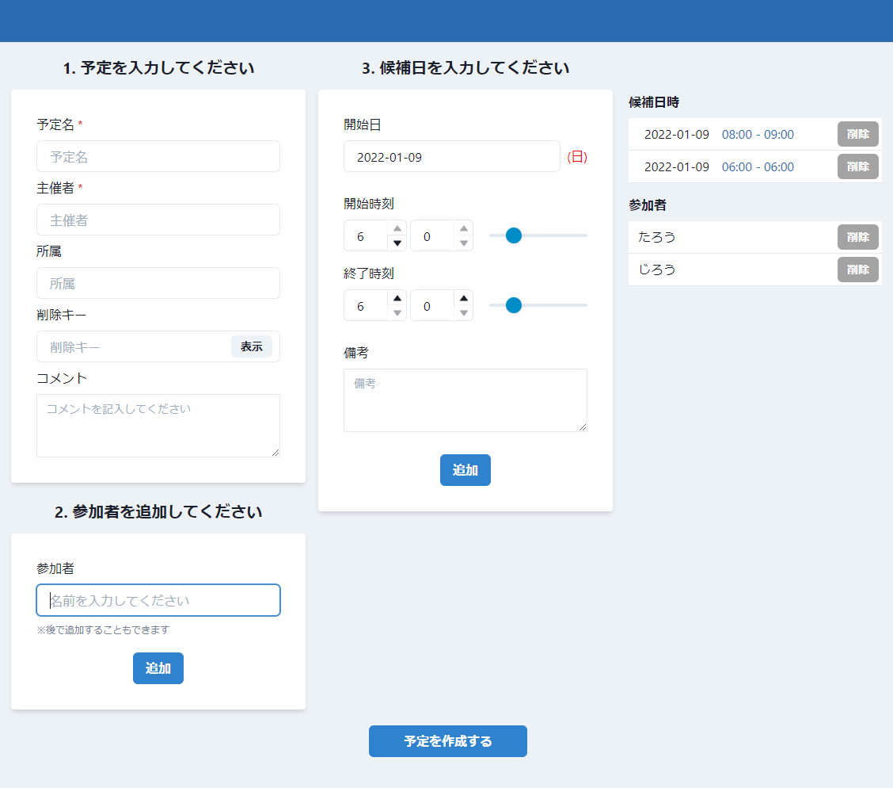

# 日程調整ツール

日程調整のためのツールです. [TBD]

Python(Django) + Next.js



## バックエンド

### Setup 

```shell
$ python3 -m venv venv && . ./venv/bin/activate && python3 -m pip install -r requirements.txt
$ python3 api/manage.py migrate
```

### Run

```shell
$ python3 manage.py runserver
```

## フロンエンド

### Setup

```shell
$ cd front
$ yarn intall
```

### Run

```shell
$ yarn dev
```
